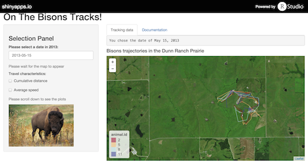

---
title       : On The Bisons Tracks!
subtitle    : Following the Dunn Ranch Prairie bisons' daily wanderings
author      : Alexandra Teste
job         : October 2015
framework   : io2012        # {io2012, html5slides, shower, dzslides, ...}
url         :
        assets: ../assets/img
highlighter : highlight.js  # {highlight.js, prettify, highlight}
hitheme     : tomorrow      # 
widgets     : []            # {mathjax, quiz, bootstrap}
mode        : selfcontained # {standalone, draft}
knit        : slidify::knit2slides
--- &twocol w1:50% w2:50%

## Dunn Ranch Prairie Bisons


<blockquote>&ldquo;Let's take a trip to the wild and follow bisons for a while ...&rdquo;</blockquote>

<br>

*** {name: left}

Over the past few years, bisons have been re-introduced to the [Dunn Ranch Prairie](http://www.nature.org/ourinitiatives/regions/northamerica/unitedstates/missouri/dunn-ranch-prairie-flyer.pdf), in Missouri. Some of them were collared by [Stephen Blake](http://www.peoplebehindthescience.com/dr-stephen-blake/)'s team, and data on their movements were collected and graciously made available to the public through the [Movebank](https://www.movebank.org/panel_embedded_movebank_webapp).


The ["On the Bisons Tracks!"](https://teal13.shinyapps.io/BisonsProject) application is a tool that allows the user to explore this dataset through a map visualization and the display of travel characteristics directly extracted from the dataset and computed from it.


*For the sake of speed and ease of understanding, the data available for exploration through this app correspond to those collected in 2013. The animal IDs have been rescaled to integers between and 1 and 12.*

*** {name: right}



--- &twocol w1:50% w2:50%

## Features

*** {name: left}

["On the Bisons Tracks!"](https://teal13.shinyapps.io/BisonsProject) allows the user to:

* Track animals, on a map, throughout the selected day
* Run cumulative distance travelled calculations and display
* Obtain information on the animals' ground speed over time.

This app is interactive with a date picker and 2 checkboxes. It updates automatically when a new date is selected.

*Note: The user should wait for a few seconds when first opening the app, to allow for the map to appear. Once it is visible, the user can interact with the app and navigate to the Documentation tab.*

*** {name: right}

```{r, echo=FALSE, message=FALSE, warning=FALSE, fig.height=3, fig.width=7}
library(stringr)
library(lubridate)
library(aspace)
library(plyr)
library(sp)
library(rgdal)
library(ggplot2)
library(scales)
library(xts)
library(gridExtra)
merged_data<-read.csv(file="~/ProgCode/Coursera_DataProducts/BisonsProject/DunnRanchBisonTrackingProject_2013_DataOnly.csv", header=TRUE, sep=",")
merged_data$timestamp<-as.POSIXlt(as.character(merged_data$timestamp), format="%Y-%m-%d %H:%M:%S")

yyear = 2013
mmonth = 5
dday = 15

daily_df <- subset(merged_data, year == yyear & month == mmonth & day == dday)
chosendate <- daily_df$timestamp[1]
print(as.character(format(chosendate, "%B %d, %Y")))

uniq <- unique(daily_df$animal.id)
counter <- 0
for (uni in uniq){
        # Extraction of the data for bison #uni
        indiv_df <- subset(daily_df,animal.id == uni)
        
        # Resampling at 15 min to allow for an easier reading of the final plot                                        
        indiv_df$timestamp<-as.POSIXlt(as.character(indiv_df$timestamp), format="%Y-%m-%d %H:%M:%S")
        tmpxts <- xts(indiv_df$ground.speed, order.by=indiv_df$timestamp) # Transforms the column into a time series object
        ep <- endpoints(tmpxts,'minutes', 15) # Finds the last timestamp in a 15min time window
        convert2<-period.apply(tmpxts, INDEX=ep, FUN=function(x) mean(x,na.rm=TRUE)) # Average of all ground speeds in that 15min window
        converted_df2 <-data.frame(timestamp=index(convert2),value=coredata(convert2),idd=rep(uni,length(index(convert2)))) # Construction of a dataframe
        names(converted_df2) <- c("timestamp","ground.speed","animal.id")
        
        counter <- counter + 1
        
        # Construction of a master dataframe with the ground speed of all animals
        if (counter == 1){
                master_dist_df2 <- converted_df2
                }
        else{
                master_dist_df2 <- rbind(master_dist_df2,converted_df2)
                }                                        
        }
# Conversion of the animal IDs into factors for better handling of the color palette
master_dist_df2$animal.id <- factor(master_dist_df2$animal.id)

# Construction of the ground speed plot
p2 <- ggplot(master_dist_df2, aes(x=timestamp, y=ground.speed, group=animal.id)) + 
        geom_line(aes(colour = animal.id)) + scale_color_brewer(palette="RdYlBu") +
        labs(x = "Time of day", y ="Ground speed (km/h)") +
        ggtitle("Average bisons speed on May 15, 2013")

# Actual plot display
p2
```

*Plot produced at the time of "slidification".*

--- 

## Documentation

Full documentation is additionally available in a separate tab. It provides explanations on:

* The source of, and context in which, the data used in the application were collected
* The transformations they underwent
* The calculations that run behind the scenes.


--- .class #id 
<style>
em {
  font-style: italic
}
</style>

## Acknowledgements & Beyond

<br>

I would like to thank Stephen Blake and his team for making these data publicly available, and the Movebank for creating such a great source of animal tracking data!

<br>

This application can be used with any other tracking (i.e. location-based) dataset, and adapted to display the metrics relevant to the scientific project in question.

<br>

As any project completed in a short amount of time, this application could benefit from improvements. I would more particularly like to add an inter-bison distance computation, to exploit the gender data available in the dataset, and to provide weekly/monthly/yearly statistics on the distances travelled and most favorite gathering grounds.


